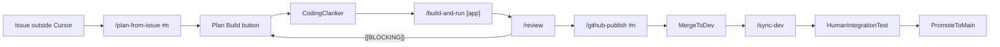

# Cursor operating model — architecture

This document maps the repo’s workflow files to official Cursor concepts and shows which guarantees come from local hooks versus GitHub-side automation. Canonical source index: [cursor_sources.md](cursor_sources.md). Human-readable workflow contract: [AGENTS.md](../AGENTS.md). Command cookbook: [operating-model-tutorial.md](operating-model-tutorial.md).

## Product-grounded principles

Official Cursor docs used for this repo:

- [Plan Mode](https://cursor.com/docs/agent/plan-mode)
- [Subagents](https://cursor.com/docs/subagents)
- [Rules](https://cursor.com/docs/rules)
- [Hooks](https://cursor.com/docs/hooks)
- [Cloud Agent best practices](https://cursor.com/docs/cloud-agent/best-practices)

Repo decisions derived from those docs:

- Use **Plan Mode** for complex work and save accepted plans into the workspace.
- Keep the human-visible surface minimal: GitHub issue, **`/plan-from-issue #n`**, the accepted plan’s **Build** button, **`/build-and-run`**, **`/review`**, **`/github-publish #n`**, and **`/sync-dev`** after merge to **`dev`** on GitHub.
- Use **subagents** only where context isolation is clearly worth it: `coding-clanker`, `review-clanker`, and `github-clanker`.
- Keep **hooks** minimal: Git safety plus coding-clanker and github-clanker issue label automation.
- Treat automation as **local-first**. If cloud execution is introduced later, document auth, secrets, network, and testability prerequisites first.

## Build-button constraint

Cursor does **not** expose a repo-local way to hard-bind the Plan **Build** button to a specific subagent. This repo therefore uses the strongest available repo-local steering instead:

- `coding-clanker` explicitly says to use it proactively and always for post-plan implementation.
- `plan-from-issue` is expected to emit a clear Build handoff with issue number and branch naming.
- [.cursor/rules/operating-model-build.mdc](../.cursor/rules/operating-model-build.mdc) is **`alwaysApply: true`** so Plan Build is instructed to **Task**-delegate `coding-clanker` instead of implementing inline.
- Minimal hooks validate coding-clanker starts and keep issue labels accurate when `coding-clanker` actually runs.

## Branch policy (strict)

| Rule | Detail |
| --- | --- |
| Work location | **Automated agents** work only in the **primary clone** on a **feature branch**. **No `git worktree add`.** |
| Branch ownership | **`coding-clanker`** creates or reuses the feature branch for local implementation. **`github-clanker`** commits and pushes that same branch and opens or updates the PR. |
| PR base | All **agent-created** pull requests must use **`gh pr create --base dev`** (or equivalent). |
| `dev` / `main` | **Forbidden** for direct agent integration: no pushes to **`dev`** or **`main`**, no agent merges into those branches, and no committing on **`dev`** or **`main`**. Humans merge PRs to `dev` and promote `dev` → `main`. |
| Promotion | **`dev` → `main`** is **human-only** after human integration checks on `dev`. |

Hooks enforce part of this via `beforeShellExecution` and coding-clanker label hooks. GitHub Actions and GitHub settings enforce the rest.

## Operating model wiring



## GitHub state contracts

### Status labels

Only one issue status label should exist at a time:

| Label | Meaning | Owner |
| --- | --- | --- |
| `status:todo` | Issue exists and Build has not started yet | Issue template |
| `status:in-progress` | `coding-clanker` is actively building or reworking on a feature branch | Coding-clanker start hook |
| `status:in-review` | Local implementation is ready for `/build-and-run`, review-agent feedback, or an open PR | Coding-clanker stop hook; github-clanker stop hook (re-assert) |
| `status:done` | PR merged to `dev`; issue closed | Merge-to-`dev` GitHub Action |

Important semantic choices:

- `status:todo` remains until coding-clanker starts.
- `status:in-review` intentionally spans the local review stage and the later published PR review stage.
- `status:done` means **merged to `dev`**, not human-tested and not promoted to `main`.

### PR body

Every PR should contain:

```md
## Summary
- Bullet list of what changed

## Test plan
- [ ] Verification step(s)

Closes #n
```

Enforcement stance:

- Local hooks enforce **base branch** and **issue-closing keywords**.
- The **Summary** contract is enforced by the PR template, `github-clanker`, tutorial commands, and review discipline rather than brittle shell parsing.

## Path mapping (concept → repo file)

| Concept | Repo path |
| --- | --- |
| Workflow contract | [AGENTS.md](../AGENTS.md) |
| Git/PR rule | [.cursor/rules/git-workflow.mdc](../.cursor/rules/git-workflow.mdc) |
| Architecture/UI rules | [.cursor/rules/architecture.mdc](../.cursor/rules/architecture.mdc), [.cursor/rules/ui-system.mdc](../.cursor/rules/ui-system.mdc) |
| Visible skills | [.cursor/skills/plan-from-issue/SKILL.md](../.cursor/skills/plan-from-issue/SKILL.md), [.cursor/skills/build-and-run/SKILL.md](../.cursor/skills/build-and-run/SKILL.md), [.cursor/skills/review/SKILL.md](../.cursor/skills/review/SKILL.md), [.cursor/skills/github-publish/SKILL.md](../.cursor/skills/github-publish/SKILL.md), [.cursor/skills/sync-dev/SKILL.md](../.cursor/skills/sync-dev/SKILL.md) |
| Subagents | [.cursor/agents/*.md](../.cursor/agents/) |
| Local hooks | [.cursor/hooks/*.mjs](../.cursor/hooks/) + [.cursor/hooks.json](../.cursor/hooks.json) |
| Merge-to-`dev` automation | [.github/workflows/issue-status-on-pr-merge.yml](../.github/workflows/issue-status-on-pr-merge.yml), [.github/workflows/delete-feature-branch-on-merge.yml](../.github/workflows/delete-feature-branch-on-merge.yml) |

## Hook wiring (Cursor event → script → guarantee)

| Cursor hook | Script(s) | Guarantee |
| --- | --- | --- |
| `beforeShellExecution` | [shell-policy.mjs](../.cursor/hooks/shell-policy.mjs) | Denies `git worktree add`, unsafe pushes, wrong PR base, and PRs that omit `Closes #n` or `Fixes #n` |
| `subagentStart` | [subagent-start-review-gate.mjs](../.cursor/hooks/subagent-start-review-gate.mjs) → [issue-status-labels.mjs](../.cursor/hooks/issue-status-labels.mjs) | Validates coding-clanker issue context, then applies **`status:in-progress`** |
| `subagentStop` | [subagent-stop-review-loop.mjs](../.cursor/hooks/subagent-stop-review-loop.mjs) → [issue-status-labels.mjs](../.cursor/hooks/issue-status-labels.mjs) | Applies **`status:in-review`** for successful coding-clanker and github-clanker runs; nudges the rework loop when `[[BLOCKING]]` appears |

There is only one `subagentStart` and one `subagentStop` entry in [hooks.json](../.cursor/hooks.json), so each hook must emit a single JSON payload to stdout.

## What hooks do not own

Hooks are not the whole product surface. The following guarantees live elsewhere:

- **Plan Build button routing** is a Cursor product behavior and can only be steered, not hard-bound, from repo files.
- **Issue closure, `status:done`, and branch deletion after merge to `dev`** live in GitHub Actions.
- **Required reviews and required checks on `dev` and `main`** live in GitHub branch protection and human process.
- **PR Summary freshness** is a `github-clanker` contract plus PR template discipline unless you later decide to add stronger CI or hook checks.

## Verification in this repo

- Scripts: [package.json](../package.json) — use **`npm run build`** for app changes until further scripts exist.
