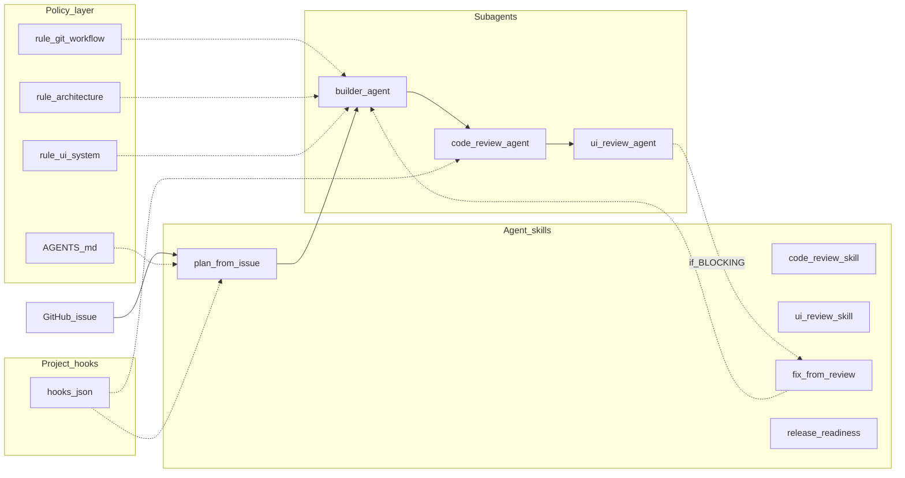

# Cursor operating model — architecture

This document maps the project’s **rules**, **skills**, **subagents**, and **hooks** to each other and to [Cursor](https://cursor.com/docs) concepts. Canonical doc index: [cursor_sources.md](cursor_sources.md). Product intent summary: [cursor-system-overview.md](cursor-system-overview.md).

## Branch policy (strict)

| Rule | Detail |
|------|--------|
| Work location | **Automated agents** work only on a **feature branch**; commit and **push only that branch**. |
| PR base | All **agent-created** pull requests must use **`gh pr create --base dev`** (or equivalent). |
| `dev` / `main` | **Forbidden** for direct agent integration: no pushes to **`dev`** or **`main`**, no agent merges into those branches, no committing on **`dev`**/**`main`**. Humans merge PRs to `dev` and promote `dev` → `main`. |
| Promotion | **`dev` → `main`** is **human-only**, guided by `/release-readiness` after QA on `dev`. |

**Cloud agent** and **subagents** follow the same rules as above (see [Cloud agent](https://cursor.com/docs/cloud-agent) in [cursor_sources.md](cursor_sources.md)).

Hooks enforce part of this via `beforeShellExecution` (see hook wiring below). The shell policy now blocks explicit pushes to protected branches and also blocks bare `git push` when currently checked out on `dev` or `main`.

---

## How the pieces fit together

- **AGENTS.md** defines the single path: Plan skill → **builder-agent** → **code-review-agent** → **ui-review-agent** (or UI N/A) → **fix-from-review** + builder loop as needed → human merge to `dev`.
- **Rules** constrain architecture, UI, and git/branch behavior.
- **Skills** are explicit procedures (invoked with `/` in Agent when `disable-model-invocation: true`). Review **skills** mirror checklists; the **standard** review step uses **subagents** per AGENTS.md.
- **Subagents** isolate implementation and review passes; review agents emit **`[[BLOCKING]]`** when appropriate.
- **Hooks** implement lightweight automation on Cursor lifecycle events (not a full CI replacement).

---

## Path mapping (overview → repo)

| Overview (logical) | Repo path |
|--------------------|-----------|
| AGENTS.md | [AGENTS.md](../AGENTS.md) |
| rules/ui-system | [.cursor/rules/ui-system.mdc](../.cursor/rules/ui-system.mdc) |
| rules/architecture | [.cursor/rules/architecture.mdc](../.cursor/rules/architecture.mdc) |
| rules/git-workflow | [.cursor/rules/git-workflow.mdc](../.cursor/rules/git-workflow.mdc) |
| skills/* | [.cursor/skills/<name>/SKILL.md](../.cursor/skills/) |
| subagents/* | [.cursor/agents/*.md](../.cursor/agents/) (Cursor canonical location) |
| hooks/* | [.cursor/hooks/*.mjs](../.cursor/hooks/) + [.cursor/hooks.json](../.cursor/hooks.json) |

---

## Hook wiring (conceptual → Cursor event → script)

Official hook reference: [Hooks](https://cursor.com/docs/hooks) (also listed in [cursor_sources.md](cursor_sources.md)).

| Conceptual hook | Cursor `hooks.json` key | Script | Behavior (v1) |
|-----------------|-------------------------|--------|----------------|
| pre-implementation-check | `beforeSubmitPrompt` | [pre-implementation-check.mjs](../.cursor/hooks/pre-implementation-check.mjs) | Hard gate: block implementation/workflow-execution prompts (including issue/plan-context prompts) unless they explicitly delegate to **`builder-agent`**. |
| post-implementation-check | `afterFileEdit` + `stop` | [after-file-edit-dirty.mjs](../.cursor/hooks/after-file-edit-dirty.mjs), [stop-post-build.mjs](../.cursor/hooks/stop-post-build.mjs) | After `Write` under `src/`, create `.cursor/hooks/.dirty` (gitignored). On agent `stop` + `completed`, run `npm run build` if dirty was set. |
| pr-open-trigger (+ branch policy) | `beforeShellExecution` | [shell-policy.mjs](../.cursor/hooks/shell-policy.mjs) | Deny `gh pr create` without `--base dev`, with `--base main`, or without `Closes #<n>`/`Fixes #<n>` in body text; deny `git push` targeting **`main`**/**`dev`** and deny bare `git push` while checked out on **`main`**/**`dev`**; on valid `gh pr create`, remind to run **code-review-agent** then **ui-review-agent** (UI N/A rule applies). |
| review-gate + builder issue labels | `subagentStart` | [subagent-start-review-gate.mjs](../.cursor/hooks/subagent-start-review-gate.mjs) → [issue-status-labels.mjs](../.cursor/hooks/issue-status-labels.mjs) | Allow subagents by default. For **builder-agent**, enforce `#<n>` in delegated task/description and validate GitHub context; deny start if missing/invalid. On valid start, set GitHub issue **`status:in-progress`** via local **`gh`**; deny if label update fails. |
| review-fix-loop + builder issue labels | `subagentStop` | [subagent-stop-review-loop.mjs](../.cursor/hooks/subagent-stop-review-loop.mjs) → [issue-status-labels.mjs](../.cursor/hooks/issue-status-labels.mjs) | When **builder-agent** completes successfully, set **`status:in-review`**. If that label update fails, emit a mandatory follow-up to fix labels before proceeding. If `summary` contains `[[BLOCKING]]`, also emit fix-loop follow-up for `/fix-from-review` and **builder-agent**. |

There is only one `subagentStart` and one `subagentStop` entry in [`hooks.json`](../.cursor/hooks.json) so each hook prints a single JSON payload to stdout. Builder label logic lives in [issue-status-labels.mjs](../.cursor/hooks/issue-status-labels.mjs) and is invoked from those scripts (not as a second `hooks.json` entry) to avoid invalid combined output.

**`stop` / `subagentStop` follow-ups** respect per-hook `loop_limit` (see `hooks.json`; default Cursor cap applies).

---

## Out of scope for Cursor hooks

- **GitHub “PR opened” webhooks** and org-level automation are not replaced by project hooks; use **GitHub Actions** or integrations for server-side rules.
- **PR merged into `dev`** — setting issue **`status:done`**, removing prior status labels, and **closing** linked issues are implemented in [.github/workflows/issue-status-on-pr-merge.yml](../.github/workflows/issue-status-on-pr-merge.yml). Merged same-repo feature branches are deleted by [.github/workflows/delete-feature-branch-on-merge.yml](../.github/workflows/delete-feature-branch-on-merge.yml) (not in Cursor hooks).
- **Team-wide enforcement** may use Cursor **Team Rules** / enterprise features ([Rules](https://cursor.com/docs/rules)) in addition to this repo.

---

## Verification in this repo

- Scripts: [package.json](../package.json) — use **`npm run build`** for app changes until further scripts exist.
