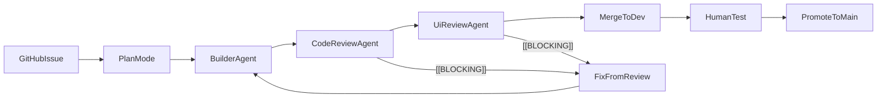

# Cursor operating model — architecture

This document maps the repo’s workflow files to official Cursor concepts and shows which guarantees come from local hooks versus GitHub-side automation. Canonical source index: [cursor_sources.md](cursor_sources.md). Human-readable workflow contract: [AGENTS.md](../AGENTS.md). Prompt cookbook: [operating-model-tutorial.md](operating-model-tutorial.md).

## Product-grounded principles

Official Cursor docs used for this repo:

- [Plan Mode](https://cursor.com/docs/agent/plan-mode)
- [Subagents](https://cursor.com/docs/subagents)
- [Rules](https://cursor.com/docs/rules)
- [Hooks](https://cursor.com/docs/hooks)
- [Cloud Agent best practices](https://cursor.com/docs/cloud-agent/best-practices)

Repo decisions derived from those docs:

- Use **Plan Mode** for complex work and save accepted plans into the workspace.
- Use **subagents** only where context isolation is clearly worth it: `builder-agent`, `code-review-agent`, `ui-review-agent`.
- Keep **rules** focused and canonical: `AGENTS.md` for workflow, `.cursor/rules/*.mdc` for specific policy.
- Use **hooks** for local guardrails, not as the only enforcement boundary.
- Treat automation as **local-first**. If cloud execution is introduced later, document auth, secrets, network, and testability prerequisites first.

## Branch policy (strict)

| Rule | Detail |
|------|--------|
| Work location | **Automated agents** work only on a **feature branch** in the **primary clone**; commit and **push only that branch**. **No `git worktree add`.** |
| PR base | All **agent-created** pull requests must use **`gh pr create --base dev`** (or equivalent). |
| `dev` / `main` | **Forbidden** for direct agent integration: no pushes to **`dev`** or **`main`**, no agent merges into those branches, no committing on **`dev`**/**`main`**. Humans merge PRs to `dev` and promote `dev` → `main`. |
| Promotion | **`dev` → `main`** is **human-only**, guided by `/release-readiness` after QA on `dev`. |

Hooks enforce part of this via `beforeShellExecution` (see table below). GitHub Actions and GitHub settings enforce the rest.

## Operating model wiring



## GitHub state contracts

### Status labels

Only one issue status label should exist at a time:

| Label | Meaning | Owner |
|------|---------|-------|
| `status:needs-plan` | Issue exists and Build has not started yet | Issue template |
| `status:in-progress` | `builder-agent` is actively building or fixing review findings | Builder start hook |
| `status:in-review` | PR is open and ready for review or re-review | Builder stop hook |
| `status:done` | PR merged to `dev`; issue closed | Merge-to-`dev` GitHub Action |

Important semantic choice:

- `status:needs-plan` remains until builder starts.
- `status:done` means **merged to `dev`**, not human-tested and not promoted to `main`.

### PR body

Every PR should contain:

```md
## Summary
- Bullet list of what changed

## Test plan
- [ ] Verification step(s)

Closes #n
```

Enforcement stance:

- Local hooks enforce **base branch** and **issue-closing keywords**.
- The **Summary** contract is enforced by the PR template, `builder-agent`, tutorial prompts, and review discipline rather than brittle shell parsing.

## Path mapping (concept → repo file)

| Concept | Repo path |
|---------|-----------|
| Workflow contract | [AGENTS.md](../AGENTS.md) |
| Git/PR rule | [.cursor/rules/git-workflow.mdc](../.cursor/rules/git-workflow.mdc) |
| Architecture/UI rules | [.cursor/rules/architecture.mdc](../.cursor/rules/architecture.mdc), [.cursor/rules/ui-system.mdc](../.cursor/rules/ui-system.mdc) |
| Plan skill | [.cursor/skills/plan-from-issue/SKILL.md](../.cursor/skills/plan-from-issue/SKILL.md) |
| Build/review agents | [.cursor/agents/*.md](../.cursor/agents/) |
| Local hooks | [.cursor/hooks/*.mjs](../.cursor/hooks/) + [.cursor/hooks.json](../.cursor/hooks.json) |
| Merge-to-`dev` automation | [.github/workflows/issue-status-on-pr-merge.yml](../.github/workflows/issue-status-on-pr-merge.yml), [.github/workflows/delete-feature-branch-on-merge.yml](../.github/workflows/delete-feature-branch-on-merge.yml) |

## Hook wiring (Cursor event → script → guarantee)

| Cursor hook | Script(s) | Guarantee |
|-------------|-----------|-----------|
| `beforeSubmitPrompt` | [pre-implementation-check.mjs](../.cursor/hooks/pre-implementation-check.mjs) | Blocks implementation/workflow-execution prompts unless they explicitly delegate to **`builder-agent`** |
| `afterFileEdit` + `stop` | [after-file-edit-dirty.mjs](../.cursor/hooks/after-file-edit-dirty.mjs), [stop-post-build.mjs](../.cursor/hooks/stop-post-build.mjs) | If `src/` changed, mark dirty and run `npm run build` on successful stop |
| `beforeShellExecution` | [shell-policy.mjs](../.cursor/hooks/shell-policy.mjs) | Denies `git worktree add`, unsafe pushes, wrong PR base, and PRs that omit `Closes #n` / `Fixes #n` |
| `subagentStart` | [subagent-start-review-gate.mjs](../.cursor/hooks/subagent-start-review-gate.mjs) → [issue-status-labels.mjs](../.cursor/hooks/issue-status-labels.mjs) | Validates builder handoff, then applies **`status:in-progress`** |
| `subagentStop` | [subagent-stop-review-loop.mjs](../.cursor/hooks/subagent-stop-review-loop.mjs) → [issue-status-labels.mjs](../.cursor/hooks/issue-status-labels.mjs) | Applies **`status:in-review`** for successful builder runs and nudges the fix loop when `[[BLOCKING]]` appears |

There is only one `subagentStart` and one `subagentStop` entry in [`hooks.json`](../.cursor/hooks.json), so each hook must emit a single JSON payload to stdout.

## What hooks do not own

Hooks are not the whole product surface. The following guarantees live elsewhere:

- **Issue closure, `status:done`, and branch deletion after merge to `dev`** live in GitHub Actions.
- **Required reviews and required checks on `dev` / `main`** live in GitHub branch protection.
- **PR Summary freshness** is a builder contract plus PR template discipline unless you later decide to add stronger CI or hook checks.
- **Cloud execution readiness** depends on environment, auth, secrets, and networking, not only repo files.

## Verification in this repo

- Scripts: [package.json](../package.json) — use **`npm run build`** for app changes until further scripts exist.
